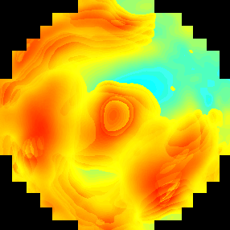
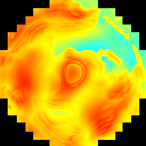
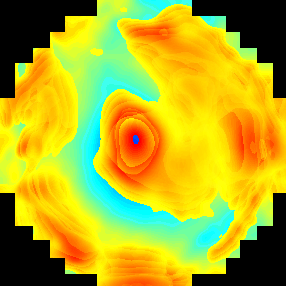
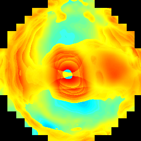
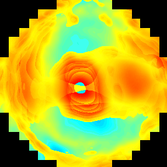

# Optimization of Electroimpedance Image Fusion using Local Search and Layer Analysis

Este proyecto presenta un enfoque para optimizar la fusión de imágenes de electroimpedancia (EIM) utilizando algoritmos de búsqueda local y análisis de capas. El sistema procesa conjuntos de 7 máscaras de imagen correspondientes a diferentes niveles de profundidad (N1-N7), buscando la combinación óptima que maximiza la detección de regiones de interés (tumores) y la preservación de los bordes.

El sistema compara dos métodos de fusión (basado en prioridad y en promedio) aplicados a regiones de interés seleccionadas mediante criterios de color. Los resultados experimentales en un conjunto de pacientes demuestran que la optimización mediante **búsqueda local, combinada con la fusión por promedio, logra un rendimiento competitivo** en comparación con otras técnicas, obteniendo mejoras cuantificables en la Relación Contraste-Ruido (CNR) y manteniendo una adecuada preservación de los bordes estructurales.

## Metodología

El problema de selección de capas se modela como un problema de optimización. Una solución se representa mediante un **vector binario de longitud 7**, donde cada posición corresponde a una de las capas (N1 a N7). Un valor de `1` indica que la capa se incluye en la fusión, mientras que `0` indica que se descarta. Esto permite explorar 127 combinaciones posibles de capas.

### 1. Detección de Regiones de Interés (ROI)

Antes de la fusión, es fundamental identificar las regiones que corresponden a tejido anómalo. Dado que las imágenes EIM utilizan mapas de color para representar la conductividad, se emplea un criterio de segmentación en el espacio de color RGB. Un píxel se considera parte de una ROI si cumple la siguiente condición, característica de zonas de alta conductividad:

`(R ≥ 60) Y (R > G) Y (G > B)`

Esta segmentación permite que el proceso de fusión se concentre exclusivamente en las áreas clínicamente relevantes.

### 2. Métodos de Fusión

Se proponen y evalúan dos estrategias distintas para combinar la información de las capas seleccionadas:

1.  **Fusión por Prioridad (Priority-based):** Las capas se superponen en orden secuencial (N1 → N7). Cuando se detecta un área roja en una capa, sus píxeles se "pintan" en la imagen final. Los píxeles ya ocupados por capas anteriores no se modifican. Este método prioriza la información de las capas más superficiales.

2.  **Fusión por Promedio (Average-based):** Este método integra la información de todas las capas seleccionadas. En las zonas donde las ROIs de múltiples capas se superponen, el color del píxel resultante se calcula como la **media aritmética** de los colores de esas capas. El objetivo es suavizar variaciones y reducir el ruido aleatorio.

### 3. Algoritmos de Optimización

Para encontrar el vector binario óptimo para cada paciente, se utilizaron dos algoritmos:

1.  **Búsqueda Exhaustiva (Fuerza Bruta):** Para establecer una línea base sólida, se realizó una búsqueda exhaustiva en un conjunto de entrenamiento. Se evaluaron las 127 combinaciones de capas para cada paciente, y el vector que maximizó el rendimiento promedio global fue seleccionado como el **"Vector de Referencia"**. El análisis arrojó el siguiente vector:
    `v_ref = [1, 0, 1, 0, 0, 0, 0]`
    Esto sugiere que, en promedio, la combinación de las capas N1 y N3 proporciona una base sólida para la detección.

2.  **Búsqueda Local (Local Search):** Este es el algoritmo principal de optimización. Explora el vecindario de un vector solución realizando cambios mínimos (voltear un bit) para encontrar mejoras incrementales. El proceso se inicia desde un punto (aleatorio o el Vector de Referencia) y continúa hasta que no se encuentran mejoras o se alcanza un máximo de iteraciones.

La función de evaluación (fitness) pondera la cantidad y consistencia de los píxeles válidos detectados:
`fitness = 0.8 * (píxeles_válidos / píxeles_detectados) + 0.2 * (píxeles_válidos / (píxeles_válidos + 50))`

## Resultados y Análisis

El rendimiento de los métodos se cuantificó utilizando dos métricas clave: **Relación Contraste-Ruido (CNR)**, que mide la detectabilidad del tumor, y **Preservación de Bordes (Edge Preservation)**, que mide la fidelidad estructural.

### Resultados Cuantitativos

La siguiente tabla resume los resultados promedio obtenidos en el conjunto de 15 pacientes. La columna "Max Layer (Base)" representa el CNR de la mejor capa individual, que sirve como línea base a superar.

| Método | CNR (Promedio ± Desv. Est.) | Edge Preserv. (Promedio ± Desv. Est.) |
| :--- | :--- | :--- |
| **Max Layer (Base)** | **3.5398 ± 3.5418** | - |
| Fusión Total (Promedio) | 0.5879 ± 0.5691 | 0.5386 ± 0.0908 |
| Fusión Total (Prioridad) | 0.3920 ± 0.4294 | 0.5549 ± 0.0998 |
| Vector Ref. (Promedio) | 0.4327 ± 0.5144 | 0.5570 ± 0.1017 |
| Vector Ref. (Prioridad) | 0.3840 ± 0.5056 | 0.5544 ± 0.0988 |
| Búsqueda Local Aleatoria (Promedio) | 0.7267 ± 0.7393 | 0.5417 ± 0.0916 |
| Búsqueda Local Aleatoria (Prioridad) | 0.5071 ± 0.5503 | 0.5424 ± 0.0940 |
| **Búsqueda Local Ref. (Promedio)** | **0.7384 ± 0.7310** | **0.5412 ± 0.0913** |
| Búsqueda Local Ref. (Prioridad) | 0.5022 ± 0.5543 | 0.5408 ± 0.0933 |

### Análisis de Resultados

Basado en los resultados cuantitativos, se extraen las siguientes conclusiones:

1.  **El Problema Central es la Degradación del Contraste:** El hallazgo más importante es que todos los métodos de fusión fallan en superar el CNR de la mejor capa individual (un promedio de **0.7384** en el mejor de los casos vs. **3.5398** de la capa base). Esto indica que la fusión indiscriminada, incluso optimizada, tiende a diluir la señal clara de una capa buena con información ruidosa de otras, degradando la calidad diagnóstica.

2.  **Mejor Método de Fusión: Fusión por Promedio:** Independientemente de la técnica de selección, la **Fusión por Promedio** demuestra ser consistentemente superior a la Fusión por Prioridad. El método de promedio obtiene valores de CNR significativamente más altos (e.g., **0.7384** vs 0.5022 para Búsqueda Local con Referencia), sugiriendo que promediar los píxeles ayuda a reducir el ruido y a mejorar el contraste.

3.  **Mejor Técnica de Optimización: Búsqueda Local:** La **Búsqueda Local iniciada desde el Vector de Referencia** es la técnica más efectiva, logrando el mejor rendimiento en CNR (**0.7384**). Esto confirma que una selección de capas adaptativa para cada paciente es crucial y superior a usar todas las capas (Fusión Total) o un vector estático (Vector de Referencia).

### Conclusión General

La combinación de **Búsqueda Local (iniciada con Vector de Referencia) y Fusión por Promedio** se posiciona como el método más robusto. Aunque no logra superar a la mejor capa individual, minimiza la degradación del contraste y maximiza la calidad de la imagen fusionada resultante en comparación con las otras estrategias evaluadas. Futuros trabajos deberían enfocarse en métodos de fusión más inteligentes que prioricen y preserven la señal de la capa de mayor calidad en lugar de promediarla.

### Comparación Visual

Las siguientes imágenes comparan el resultado de la **Búsqueda Local (Ref. Vector + Promedio)** contra la **Fusión Total de las 7 capas (Promedio)**. Se observa cómo la selección inteligente de capas puede reducir el ruido y mejorar la definición de las ROIs.

#### Paciente C0793i
*Vector Resultante: `[0 1 1 1 1 1 1]`*
| Búsqueda Local (Ref. Vector + Promedio) | Fusión Total (7 Capas + Promedio) |
| :---: | :---: |
|  |  |

#### Paciente C0014d
*Vector Resultante: `[1 1 1 1 1 1 0]`*
| Búsqueda Local (Ref. Vector + Promedio) | Fusión Total (7 Capas + Promedio) |
| :---: | :---: |
|  |  |

#### Paciente C0012d
*Vector Resultante: `[1 1 1 1 1 1 0]`*
| Búsqueda Local (Ref. Vector + Promedio) | Fusión Total (7 Capas + Promedio) |
| :---: | :---: |
|  |  |

## Requisitos y Uso del Sistema

### Requisitos

**MATLAB**
- MATLAB con Image Processing Toolbox
- Archivos de imagen en formato BMP RGB
- Estructura de nombres: `C0683d_N[1-7]_mask.bmp`

**Python**
- Python 3.6 o superior
- Librerías: NumPy, OpenCV (cv2), SciPy, scikit-image, Matplotlib

### Configuración y Uso

#### Validación de Instalación
Ejecutar primero para verificar que todas las librerías están instaladas:
```bash
python3 test_installation.py
```

